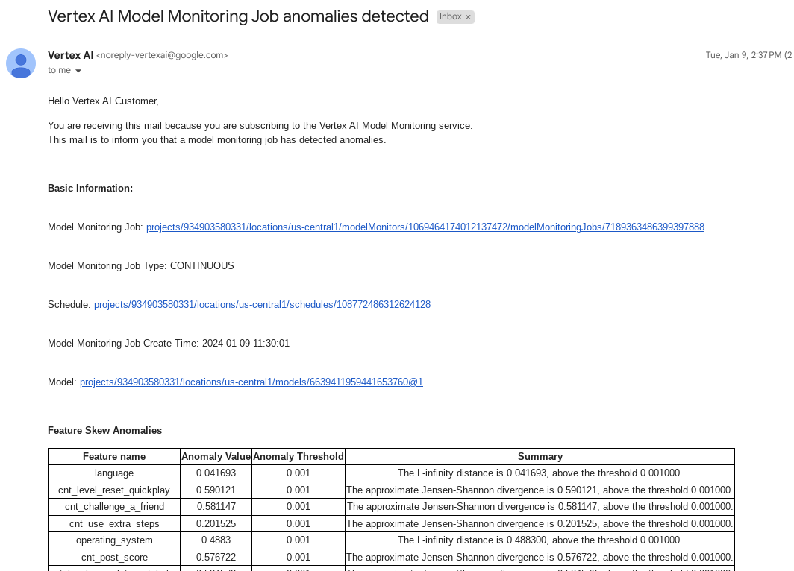
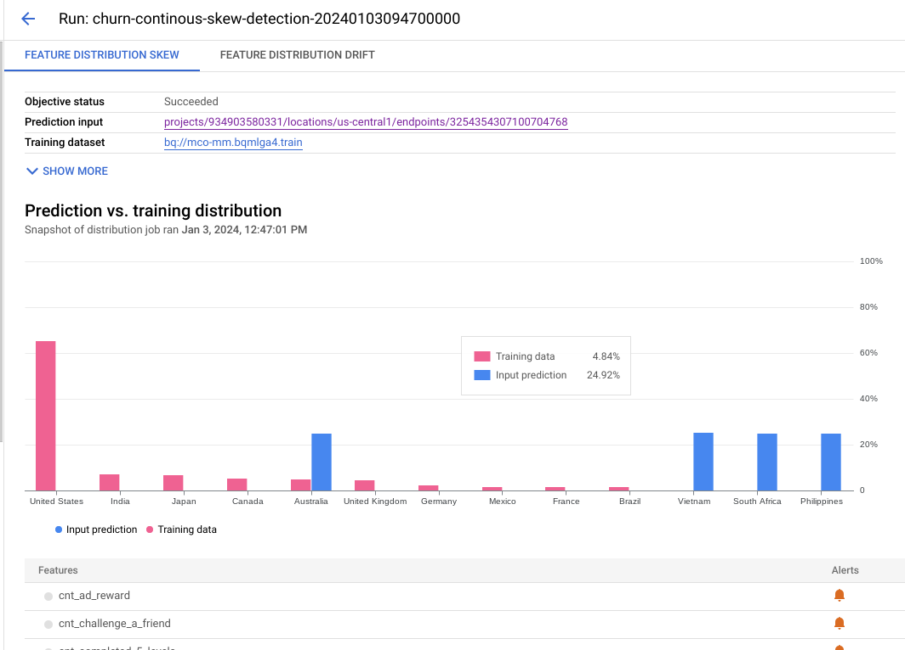
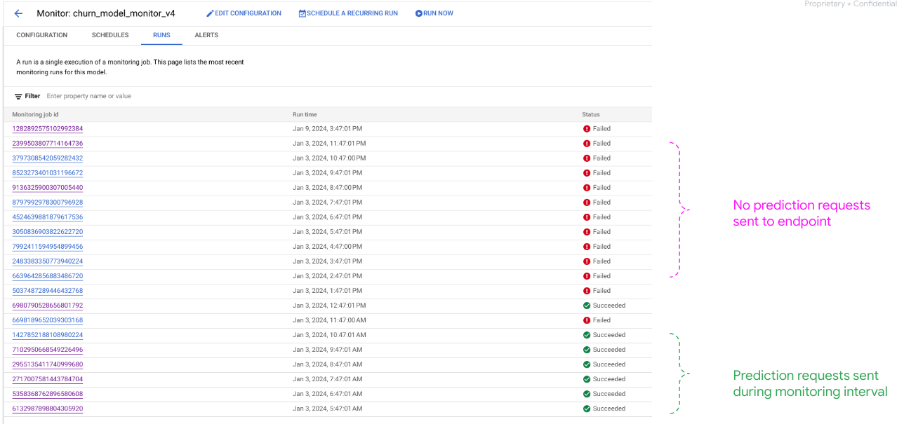
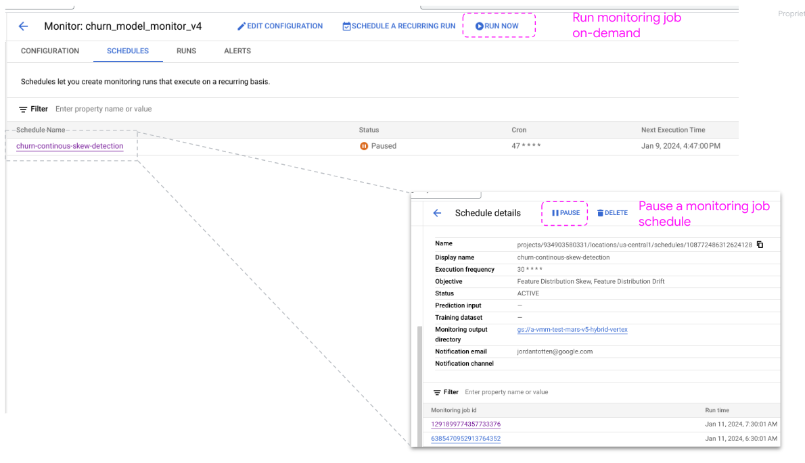
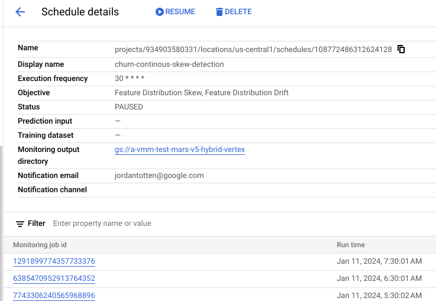
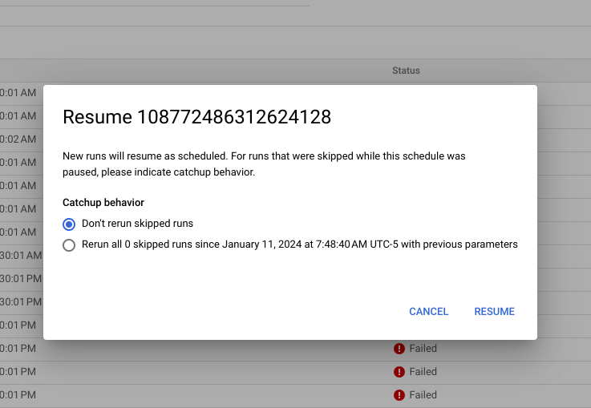

# Vertex AI Centralized Model Monitoring (private preview)


## How to use this repo
--

1. Use one of the notebooks to configure and deploy a model, endpoint, and model monitoring job
2. Ensure the same features configured for monitoring are specified in the `simulated_traffic/main.py` file. This will send prediction requests with feature values the deviate from the baseline training distributions. Numerical features will be skewed with a `multiplier`; for categorical values, just choose a subset of values to send.   
3. From command line, send skewed traffic to endpoint to trigger monitoring alerts (check all possible args and default values): 

```
python simulated_traffic/main.py --count=10 --multiplier=2 --endpoint_id=807316412694528000
```
4. Once monitoring job runs (per the schedule defined in the monitoring config in (1)), get email alerts and view deviations in Vertex AI Monitoring console:

**email alerts:**



**console view:**



5. **Note: if during a scheduled monitoring run, the endpoint recieves no prediction requests, the Monitoring job status will fail:**



6. You can easily `pause` a monitoring job when it's not needed



7. Similarly, you can `resume` the job, or once (enough) skewed prediction requests are sent: run it on-demand:



*when resuming a Model Monitoring job schedule, you have the option to either (1) resume from this time forward **only** or (2) additionally rerun every inerval skipped while paused:*



--

## pip installs

**install dependencies**
```
pip install --upgrade --force-reinstall google-cloud-aiplatform --user
pip install --upgrade --force-reinstall google-cloud-bigquery --user
pip install --upgrade --force-reinstall pandas-gbq --user
pip install --upgrade --force-reinstall 'tensorflow_data_validation[visualization]<2' --user
```

**Download Model Monitoring Experimental SDK**
```
gsutil cp gs://cmm-public-data/sdk/google_cloud_aiplatform-1.36.dev20231025+centralized.model.monitoring-py2.py3-none-any.whl .
pip install --upgrade --force-reinstall google_cloud_aiplatform-1.36.dev20231025+centralized.model.monitoring-py2.py3-none-any.whl --user
```

## User Guides

* SDK: [Experimental Python SDK User Guide](https://docs.google.com/document/d/1v4WxRXj9EZxqhO6UChWRGBsYLpnCkwwWrM-eb4kaDQ4/edit?resourcekey=0-AH7cd8evs1ghl7L18Eauiw)
* REST API: [Experimental REST API User Guide](https://docs.google.com/document/d/10CR4040fQfDIt87qZr5t_EXkrFKRm_jc9NCOIy8RLes/edit?resourcekey=0-m9El9DRcDEAlGg3ziPZZtA)

## To send skewed traffic to endpoint

> *Note: check args and default values:*

```
python simulated_traffic/main.py --count=3
```

### Importing

```
from google.cloud import aiplatform
from google.cloud.aiplatform.private_preview.centralized_model_monitoring import model_monitor
```

### Create Model Monitoring job

#### Option 1: Create a Model Monitor reference to a model registered in Vertex Model Registry.

```
my_model_monitor = model_monitor.ModelMonitor.create(
    display_name='my-display-name',
    model_name='projects/123/locations/us-central1/models/321',
    model_version_id='1',
    # Optional, for default model monitoring spec.
    objective_config=default_objective_config,
    output_config=default_output_config,
    notification_config=default_notification_config,
)

```

#### Option 2: Create a Model Monitor for a model outside Vertex AI.

```
my_model_monitor = model_monitor.ModelMonitor.create(
    display_name='my-display-name',
    model_name='my-model',
    # Optional, for default model monitoring spec.
    objective_config=default_objective_config,
    output_config=default_output_config,
    notification_config=default_notification_config,
)
```

### Data Ingestion Options

#### Training Data

We support various training data locations, you could choose one of the following options depending on where your training data is stored.

##### Option 1: Google Cloud Storage

```
TRAINING_GCS = model_monitor.spec.MonitoringInput(
    gcs_uri='gs://cmm_training_input/adopted/training.csv',
    # supported: csv, jsonl
    data_format='csv',
    ground_truth_field='Adopted'
)
```

##### Option 2: BigQuery

```
TRAINING_BIGQUERY = model_monitor.spec.MonitoringInput(
    table_uri='bq://cmm-test.iris_training.data',
    ground_truth_field='Adopted'
)
```

##### Option 3: Vertex AI managed dataset

```
TRAINING_DATASET = model_monitor.spec.MonitoringInput(
    vertex_dataset='projects/123/locations/us-central1/datasets/666',
    ground_truth_field='Adopted'
)
```

#### Serving Data

We support various serving data locations, you could choose one of the following options depending on how you served your model.

##### Option 1: Batch Prediction Job Output

```
BATCH_PREDICTION_JOB = model_monitor.spec.MonitoringInput(
    batch_prediction_job='projects/123/locations/us-central1/batchPredictionJobs/888'
)
```

##### Option 2: Vertex AI Endpoint Logging
For this option, you will first need to enable the endpoint logging collection.

```
# Create an endpoint with logging enabled. Specify the logging sampling rate and Bigquery destination.
endpoint = aiplatform.Endpoint.create(
    display_name='my-endpoint',
    enable_request_response_logging=True,
    request_response_logging_sampling_rate=1.0,
    request_response_logging_bq_destination_table="bq://my-project.dataset"
)

# Deploy model to this endpoint
endpoint.deploy(model=model,
    traffic_percentage=100,
    min_replica_count=1,
    max_replica_count=1,
    machine_type='n1-standard-4'
)

# After you enabled the endpoint, paste the endpoint resource name as monitoring input.
VERTEX_ENDPOINT = model_monitor.spec.MonitoringInput(
    endpoints=[endpoint.name]
)
```

##### Option 3: BigQuery with Table
For this option, you will need to log/store your serving data to BigQuery, each feature corresponding to a BigQuery column, ‘timestamp_field’ is required if you’d like to specify a time window or you want to do continuous monitoring.

```
BIGQUERY_TABLE_INPUT = model_monitor.spec.MonitoringInput(
    table_uri='bq://cmm-test.iris_production.data',
    timestamp_field='logging_time')
)
```

##### Option 4: BigQuery with query
For this option, you will need to log/store your serving data to BigQuery, each feature corresponding to a BigQuery column, ‘timestamp_field’ is required if you’d like to specify a time window or you want to do continuous monitoring (Make sure ‘timestamp_field’ is selected in the query).

```
BIGQUERY_TABLE_QUERY = model_monitor.spec.MonitoringInput(
    query='select * from `cmm-test.iris_production.data`',
    timestamp_field='logging_time'
)
```

### Monitoring Objectives

In experimental launch, we support two monitoring objectives:
* **Feature Distribution Skew** (Training-serving skew) occurs when the feature data distribution in production deviates from the feature data distribution used to train the model. If the original training data is available.
* **Feature Distribution Drift** (Serving drift) occurs when feature data distribution in production changes significantly over time. You can enable drift detection to monitor the input data for changes over time.

You can enable both skew and drift detection in one model monitoring job.

Model Monitoring supports feature skew and drift detection for categorical and numerical features:
* Categorical features are data limited by number of possible values, typically grouped by qualitative properties. For example, categories such as product type, country, or customer type.
* Numerical features are data that can be any numeric value. For example, weight and height.

Once the skew or drift for a model's feature exceeds an alerting threshold that you set, Model Monitoring sends you an email alert. 

#### Feature Distribution Skew
```
# Skew detection must have training baseline specified
objective_config=model_monitor.spec.ObjectiveSpec(
    # 'baseline' is the training dataset
    baseline=TRAINING_GCS,
    target=BATCH_PREDICTION_JOB,
    feature_distribution_skew=model_monitor.spec.SkewSpec(
        default_threshold=0.0002,
        feature_thresholds={"sepal_length_cm":0.0001}
    )
)
```

#### Feature Distribution Drift
```
objective_config=model_monitor.spec.ObjectiveSpec(
    target=VERTEX_ENDPOINT,
    feature_distribution_drift=model_monitor.spec.DriftSpec(
        default_threshold=0.3,
        feature_thresholds={"color":0.1},
        window="2h"
    )
)
```

## Interpret results

### Sample create job email...


### If there is any anomaly detected, you will receive an email like


### Checking console

> TODO